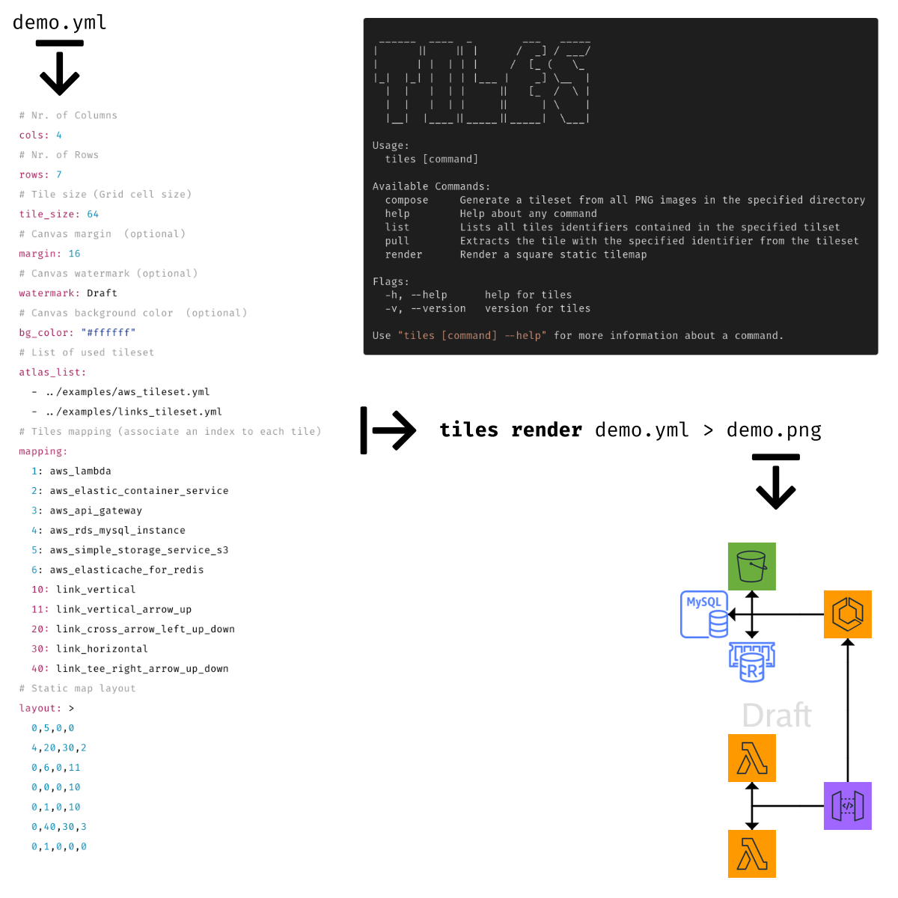
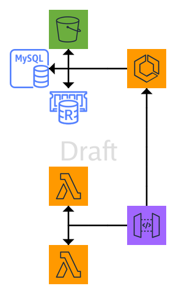

# **Tiles**

> Commandline tool that makes building tilesets and rendering static tilemaps super easy!

**Features**

- create your own tilesets _"libraries"_ (ready to reuse)
- inspect, list and extract tiles from tilesets
- define a tilemap using one or more tileset
- render a tilemap as PNG images
- eventually add a watermark to the tilemap



### Overview

Tilemaps are a very popular technique in 2D game development, consisting of building the game world or level map out of small, regular-shaped images called tiles.

The most efficient way to store the tile images is in an atlas or tileset 

- all of the required tiles grouped together in a single image file

When it's time to draw a tile, only a small section of this bigger image is rendered on the grid.

#### Static square tilemaps

Square-based tilemaps are the most simple implementation for two perspectives:

- top-down (like many RPG's or strategy games)
- side-view (like platformers such as Super Mario Bros)
- architecture diagrams...why not!? 😏

# How to use **tiles**

## All available commands

```bash
tiles --help
```

## Generate a tileset

Let's say you have all your PNG images (square in size, 96x96 for example) in one folder and you want to create a new tileset:

```bash
tiles compose /path/to/png/images/
```

By default the generated tileset (it's a YAML) is printed on the terminal. If you want to save the result to a file you can redirect `>` the output:

```bash
tiles compose /path/to/png/images/ > my_tileset.yml
```

### Ready-To-Use tilesets

| Set                    | URL                                                      |
|:-----------------------|:---------------------------------------------------------|
| AWS Icons              | [./examples/aws_tileset.yml](./examples/aws_tileset.yml) |
| Arrows and Connectors  | [./examples/links_tileset.yml](./examples/links_tileset.yml) |


## Lists all tiles identifiers contained in the specified tilset

```bash
tiles list /path/to/my_tileset.yml
```

## Extracts the tile PNG with the specified identifier from the tileset

```bash
tiles  pull --id aws_waf ../examples/aws_tileset.yml
```

By default the PNG data is dumped on the terminal. If you want to save the result to a file you can redirect `>` the output:

```bash
tiles  pull --id aws_waf ../examples/aws_tileset.yml > aws_waf.png
```

## Rendering a static tilemap

The first step is to create the static tilemap using the following YAML syntax:

```yml
# Nr. of Columns
cols: 4
# Nr. of Rows
rows: 7
# Tile size (Grid cell size)
tile_size: 64
# Canvas margin  (optional)
margin: 16
# Canvas watermark (optional)
watermark: Draft
# Canvas background color  (optional)
bg_color: "#ffffff"
# List of used tileset
atlas_list:
  - ../examples/aws_tileset.yml
  - ../examples/links_tileset.yml
# Tiles mapping (associate an index to each tile)
mapping:
  1: aws_lambda
  2: aws_elastic_container_service
  3: aws_api_gateway
  4: aws_rds_mysql_instance
  5: aws_simple_storage_service_s3
  6: aws_elasticache_for_redis
  10: link_vertical
  11: link_vertical_arrow_up
  20: link_cross_arrow_left_up_down
  30: link_horizontal
  40: link_tee_right_arrow_up_down
# Static map layout
layout: >
  0,5,0,0
  4,20,30,2
  0,6,0,11
  0,0,0,10
  0,1,0,10
  0,40,30,3
  0,1,0,0,0
```

👉 [examples/tilemap_demo_1.yml](./examples/tilemap_demo_1.yml).

Then execute the _'render'_ command:

```sh
tiles render ./examples/tilemap_demo_1.yml > ./examples/tilemap_demo_1.png
```

output:



# Installation Steps

To build the binaries by yourself, assuming that you have Go installed, you need [GoReleaser](https://goreleaser.com/intro/).

Here the steps:

### Grab the source code

```bash
git clone https://github.com/lucasepe/tiles.git
```

### Change dir to the tool folder

```bash
cd tiles/cli
```

### Run GoReleaser

```bash
goreleaser --rm-dist --snapshot --skip-publish
```

you will found the binaries for:

- MacOS into the folder _dist/tiles_darwin_amd64/_
- Linux into the folder _dist/tiles_linux_amd64/_
- Windows into the folder _dist/tiles_windows_amd64/_

## Ready-To-Use Releases 

If you don't want to compile the sourcecode yourself, [Here you can find the tool already compiled](https://github.com/lucasepe/tiles/releases/latest) for:

- MacOS
- Linux
- Windows

---

# CHANGE LOG

👉 [Record of all notable changes made to a project](./CHANGELOG.md)
